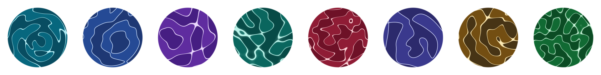

<!--
  Hero image / GIF placeholder.
  Drop the asset at docs/hero.png (or docs/hero.gif for a breathing loop) and
  update the src below. The file does not exist yet, so this image will show
  its alt text until it is added. Suggested content: a row of ~8 avatars in all
  three styles at 64–96 px on a neutral background.
-->
<p align="center">
  
</p>

<p align="center"><strong>Any string becomes a wave-interference avatar. Same name, same avatar, forever.</strong></p>
<p align="center"><a href="https://whoisanku.github.io/wavemark/">Live playground</a> · <a href="SPEC.md">Spec</a></p>

# wavemark

`wavemark` is a tiny open source avatar library. It hashes any string (a username, an email, a user id) into 3–5 coherent wave sources, sums their interference field over a disk, and draws the avatar from that field. Nothing is stored; the picture is recomputed from the name every time.

- **Deterministic** — same string in, same avatar out, on every machine.
- **Zero dependencies** — one ESM file, written in TypeScript, types included.
- **~2.4 KB** min+gzip.
- **Three styles** — `nodal` (default), `pen`, `halo`.
- **A circle with a soft edge** — pixels outside the disk are transparent, so it drops into any UI.
- **Breathe** — an optional slow, in-place animation that never drifts from the static identity.

## Install

```sh
npm i wavemark
```

Or straight from a CDN, no build step:

```html
<script type="module">import { wavemark } from 'https://cdn.jsdelivr.net/npm/wavemark/+esm'</script>
```

unpkg works too (`https://unpkg.com/wavemark`). Once published, the package page will be https://www.npmjs.com/package/wavemark.

## Quick start

### Draw into a canvas

`wavemark` renders at the canvas's backing resolution (`canvas.width × canvas.height`, square). Set that for sharpness, and control the displayed size with CSS. The avatar is already a circle with a soft rim, but `border-radius: 50%` is still recommended so the box never shows through on odd backgrounds.

```html
<canvas id="avatar" width="128" height="128" style="width: 64px; height: 64px; border-radius: 50%"></canvas>

<script type="module">
  import { wavemark } from 'https://cdn.jsdelivr.net/npm/wavemark/+esm'; // or 'wavemark' with a bundler

  wavemark('ada', document.getElementById('avatar'));
  // or pick a style:
  wavemark('ada', document.getElementById('avatar'), { style: 'pen' });
</script>
```

### Tiny avatars (≤ 48 px)

The renderer has no anti-aliasing, so at a 24–32 px backing a nodal line breaks into dots. Giving the visible canvas a bigger backing does **not** fix it — browsers minify canvases with a bilinear filter that skips pixels. Render offscreen at a few times the device size, then `drawImage` it down with high-quality smoothing, which applies a real area filter:

```js
import { wavemark } from 'wavemark';

function tinyAvatar(name, canvas, cssSize, options) {
  const dpr = window.devicePixelRatio || 1;
  canvas.width = canvas.height = Math.round(cssSize * dpr);
  canvas.style.width = canvas.style.height = `${cssSize}px`;

  const off = document.createElement('canvas');
  off.width = off.height = canvas.width * 4;
  wavemark(name, off, options);

  const ctx = canvas.getContext('2d');
  ctx.imageSmoothingQuality = 'high';
  ctx.drawImage(off, 0, 0, canvas.width, canvas.height);
}
```

This is what the demo does for its 24 px and 60 px avatars. The `nodal` and `halo` line widths are defined relative to the disk, so the look is unchanged; `pen` draws a hairline measured in backing pixels, so for `pen` render directly at device resolution instead.

### Use it as an ``

`wavemark.toDataURL` renders offscreen and returns a PNG data URL. `size` is the CSS pixel size; it renders at 2× internally so it stays crisp on high-DPI screens.

```js
import { wavemark } from 'wavemark';

const img = document.createElement('img');
img.src = wavemark.toDataURL('grace', 40, { style: 'halo' });
img.width = img.height = 40;
img.style.borderRadius = '50%';
document.body.append(img);
```

### Breathe

`breathe: true` slowly oscillates the wave phases in place at ~30 fps. Call `stop()` on the returned handle when the avatar leaves the screen.

```js
const handle = wavemark('turing', canvas, { breathe: true });

// later, e.g. on unmount:
handle.stop();
```

### Override the palette

The palette is normally picked by the hash. Pass your own `[darkest, mid, lightest]` triple of RGB arrays to match a theme; the wave pattern itself stays the same.

```js
wavemark('ankit', canvas, {
  palette: [[15, 23, 42], [100, 116, 139], [241, 245, 249]],
});
```

## API

### `wavemark(name, canvas, options?)`

Draws the avatar into `canvas` at its current backing resolution and returns a handle.

| Parameter | Type | Description |
| --- | --- | --- |
| `name` | `string` | The string to hash. Empty or whitespace-only names fall back to `'anonymous'`. Non-blank names are hashed exactly as given (no trimming). |
| `canvas` | `HTMLCanvasElement` | Target canvas. Rendered at `canvas.width × canvas.height`; use a square canvas (a non-square one gets a `min(width, height)` square at the top-left and the rest is left untouched). Display size is up to your CSS. |
| `options` | `WavemarkOptions` | Optional. See below. |

Returns a `WavemarkHandle`.

### `WavemarkOptions`

| Option | Type | Default | Description |
| --- | --- | --- | --- |
| `style` | `'nodal' \| 'pen' \| 'halo'` | `'nodal'` | Rendering style. Any other value throws a `RangeError`. |
| `breathe` | `boolean` | `false` | Slow in-place phase oscillation. |
| `palette` | `[RGB, RGB, RGB]` | hash-picked | Override the palette as `[darkest, mid, lightest]`, each an `[r, g, b]` triple in 0–255. |

### `WavemarkHandle`

| Member | Description |
| --- | --- |
| `stop()` | Stops the breathe animation. No-op if `breathe` was `false`, or if the animation was already stopped. Safe to call more than once. |

### `wavemark.toDataURL(name, size = 64, options?)`

Renders offscreen and returns a PNG data URL (a string starting with `data:image/png`). `size` is the CSS pixel size; the image is rendered internally at 2× for sharpness. `style` and `palette` apply; `breathe` is ignored because a data URL is a single frame.

**Browser only.** It creates a canvas via `document`, so it throws a clear `Error` if `document` is undefined (for example, during server-side rendering).

### Behavior notes

- **Empty names.** `''`, `'   '`, `null` and `undefined` all render the avatar for `'anonymous'`.
- **Re-rendering.** Calling `wavemark` again on the same canvas stops any previous animation on that canvas before drawing.
- **Frame rate.** Breathing runs at roughly 30 fps by rendering on every other `requestAnimationFrame`. The per-pixel distance and falloff tables are precomputed once, so each frame is just a sine sum and a paint pass.
- **Reduced motion.** If the user agent reports `prefers-reduced-motion: reduce`, a static frame is rendered even with `breathe: true`. You still get a handle; its `stop()` is a no-op.
- **Zero-size canvases.** A canvas with `width` or `height` of 0 draws nothing and returns a no-op handle.

### Types

The public surface, from [`src/types.ts`](src/types.ts) and [`src/index.ts`](src/index.ts):

```ts
export type WavemarkStyle = 'nodal' | 'pen' | 'halo';

export type RGB = [number, number, number];

export interface WavemarkOptions {
  /** Rendering style. Default: 'nodal'. */
  style?: WavemarkStyle;
  /** Slow in-place phase oscillation. Default: false. */
  breathe?: boolean;
  /** Override the hash-picked palette: [darkest, mid, lightest]. */
  palette?: [RGB, RGB, RGB];
}

export interface WavemarkHandle {
  /** Stops the breathe animation. No-op if breathe was false. */
  stop(): void;
}

/**
 * Draws the avatar into the given canvas at its current backing resolution
 * (canvas.width × canvas.height; use a square canvas). The caller controls
 * display size via CSS. Calling wavemark again on the same canvas stops any
 * previous animation on it first.
 */
export function wavemark(
  name: string,
  canvas: HTMLCanvasElement,
  options?: WavemarkOptions
): WavemarkHandle;

export namespace wavemark {
  /**
   * Renders offscreen and returns a PNG data URL. `size` is the CSS pixel size;
   * rendered internally at 2× for sharpness. Default size: 64. Browser only —
   * throws a clear Error if `document` is unavailable.
   */
  function toDataURL(name: string, size?: number, options?: WavemarkOptions): string;
}
```

## How the physics works

1. **Name → seed.** The string is hashed with `cyrb128` into a 32-bit seed, which seeds a `mulberry32` PRNG. Both are integer-exact, so every platform draws the same random sequence.

2. **Seed → wave sources.** The PRNG picks 3–5 point sources. Each one gets a position (a direction and a distance from the center, in units of the disk radius), a wavelength λ and hence a wavenumber `k = 2π/λ`, a static phase φ, and a breathe frequency and amplitude. Finally it picks one of ten three-stop palettes.

3. **Sources → field.** Pixel coordinates are normalized so the disk is the unit circle. For each pixel, the field is the sum over sources of `amplitude(d) · sin(k·d − φ)`, where `d` is the distance from the pixel to that source and the amplitude falls off gently as `1/(1 + 0.6·d)`. The per-source `k·d` and amplitude tables depend only on the name and the canvas size, so they are computed once and reused for every breathe frame.

4. **Field → picture.** The field is tone-mapped with `tanh` (scaled by a gain that shrinks with the number of sources) into a value `tt` in [0, 1], with the field's zero set landing on `tt = 0.5`. The avatar is drawn from that zero set — the nodal lines, where the waves cancel:
   - **nodal** draws a soft line wherever `tt` crosses 0.5.
   - **pen** draws a uniform-width hairline by dividing the field value by the local gradient magnitude, which approximates the pixel distance to the zero set regardless of how steep the wave is there.
   - **halo** is the nodal core plus a faint, much wider bloom around it.

   Colors come from a 3-stop palette `[darkest, mid, lightest]`: the base is a faint two-tone shading chosen by the sign of the field (two nearby dark stops), the line color is an accent near the light end, and each pixel is a blend of base and accent by line intensity. Pixels outside the disk get alpha 0, with a short soft rim just inside the edge.

5. **Breathe.** Animation never changes the geometry; it only oscillates each source's phase as `φ + a·sin(ωt)`. The pattern moves in place and always returns to where it started, so identity never drifts. `t = 0` is the static avatar.

## Determinism

- **Parameters are exact everywhere.** The hash and the PRNG use only 32-bit integer math (`Math.imul`, shifts, xor), so the same string produces the same seed, the same random sequence, the same number of sources and the same palette in every JavaScript engine. The derived source coordinates pass through `Math.cos`/`Math.sin`, which engines may round differently in the last bit — which is why the params fixture snapshots them rounded to 6 decimals.
- **Pixels are identical per engine.** The rendered RGBA bytes are guaranteed to match across runs on the same JS engine. Across engines (V8, JavaScriptCore, SpiderMonkey), `Math.sin` and `Math.tanh` may differ in the last few bits of floating point, which can flip a low-order color value on a handful of pixels. The avatars are visually identical; only a byte-for-byte hash might differ.
- **Fixtures.** `test/fixtures/params.json` holds a snapshot of the sources (rounded to 6 decimals) and palette index for `ankit`, `ada`, `grace` and `turing`; `test/fixtures/pixels.json` holds SHA-256 hashes of the RGBA bytes handed to `putImageData` (not a canvas `getImageData` read-back, which premultiplies the soft rim) for the 128 px render of `ankit` in all three styles — plus `ada`, `grace`, `turing`, a 256 px pen render and one breathe frame — along with the engine that produced them (Node 24 / V8, which CI also uses). The test suite compares against both. They are committed and are not meant to change.

## Development

Everything is TypeScript — library, demo, tests and scripts. Tests and scripts run on Node's native type stripping, so there is no transpile step outside `npm run build`. Requires Node 24 (the engine the pixel fixtures were recorded on, and what CI uses). `npm install` pulls in the dev dependencies (esbuild, TypeScript, @types/node); there are no runtime dependencies.

| Script | What it does |
| --- | --- |
| `npm run typecheck` | `tsc` over `src/`, `demo/`, `test/` and `scripts/`. No output. |
| `npm test` | The `node:test` suites in `test/*.test.ts`: determinism against the fixtures, avalanche sanity, the API contract (against a tiny fake DOM), and zero-dependency / package-hygiene checks. |
| `npm run build` | Bundles `src/index.ts` to `dist/wavemark.js` (minified ESM + sourcemap), emits declarations to `dist/types/`, bundles the demo to `demo/app.js`, and prints the min+gzip size (warns above 3.5 KB). |
| `npm run dev` | Rebuilds the demo on change and serves it at http://localhost:5173/demo/. |
| `npm run check` | `typecheck` + `test` + `build` in sequence (CI runs the same, plus `npm pack --dry-run`). |
| `npm run test:fixtures` | Regenerates `test/fixtures/*.json`. **Do not run this casually.** The fixtures pin the approved output of the frozen math; if they need regenerating, something changed every user's avatar. |

### Repo layout

```
src/
  core/             the frozen math from SPEC.md — do not edit
    hash.ts           cyrb128 + mulberry32
    palettes.ts       PALETTES, ramp, deriveColors
    params.ts         makeParams: name -> wave sources (rnd() order is load-bearing)
    field.ts          buildField / computeField
    paint.ts          the three styles
  render.ts         glue: createRenderer, renderPixels (headless; used by the tests)
  types.ts          public types
  index.ts          public API: wavemark(), wavemark.toDataURL()
demo/               the playground: index.html, style.css, app.ts (bundled to app.js)
test/               node:test suites, helpers (fake DOM, snapshot), committed fixtures
scripts/            build.ts, dev.ts, fixtures.ts
.github/workflows/  ci.yml (typecheck, test, build, pack), pages.yml (deploys demo/)
tsconfig.json       typecheck config (no emit); tsconfig.build.json emits dist/types/
dist/               build output (gitignored): wavemark.js (+ map), types/{index,types}.d.ts
SPEC.md             the source of truth for the math, API and behavior
CLAUDE.md           working rules and commands for contributors (and AI assistants)
```

The math in `src/core/` is frozen per `SPEC.md`: no constant, palette value, formula or `rnd()` call order changes, because every one of them defines the approved look and the determinism contract. Packaging, tooling, tests and the demo are fair game. The demo is deployed to GitHub Pages from `main` by `.github/workflows/pages.yml`.

## License

MIT
